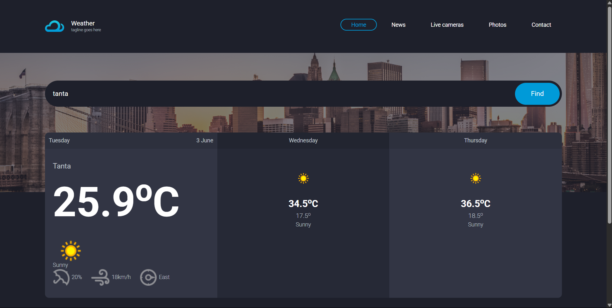

# Weatherly

A modern, responsive weather forecast web app that lets users search for any city and view real-time weather conditions and a 3-day forecast. Built with HTML, CSS, JavaScript, Bootstrap, and WeatherAPI.

---

## Features

- 🌤️ **Live Weather Search:** Instantly search for any city and get up-to-date weather information.
- 📅 **3-Day Forecast:** View today’s weather and the forecast for the next two days.
- 📱 **Responsive Design:** Fully mobile-friendly with adaptive navigation.
- 🎨 **Modern UI:** Clean, attractive interface inspired by the latest design trends.
- 📧 **Email Subscription:** Users can subscribe for updates.
- 🔗 **Social Links:** Connect with us on social media.

---

## Demo



---

## Getting Started

### Prerequisites

- [Node.js](https://nodejs.org/) (for local development, optional)
- A modern web browser

### Installation

1. **Clone the repository:**
    ```bash
    git clone https://github.com/Ahmedtamerr505/weatherly.git
    cd weatherly
    ```

2. **Open `index.html` in your browser.**

3. **(Optional) Set your own WeatherAPI key:**
    - Open `js/index.js`
    - Replace the API key in the fetch URL with your own from [WeatherAPI](https://www.weatherapi.com/).

---

## Project Structure

```
assignment12/
│
├── css/
│   └── style.css
├── images/
│   └── ... (logo, icons, backgrounds)
├── js/
│   ├── app.js
│   └── index.js
├── index.html
└── README.md
```

---

## Usage

- Type a city name in the search bar and press enter or click "Find".
- View the current weather and 3-day forecast.
- Subscribe with your email for updates.
- Use the navigation menu to explore more features.

---

## Technologies Used

- HTML5 & CSS3
- JavaScript (ES6)
- [Bootstrap 5](https://getbootstrap.com/)
- [WeatherAPI](https://www.weatherapi.com/)
- [Font Awesome](https://fontawesome.com/)

---

## Credits

- Weather icons and data provided by [WeatherAPI](https://www.weatherapi.com/).
- UI inspired by Themezy Weather template.
- Designed and developed by AhmedTamer.

---

## License

This project is licensed under the MIT License.

---

## Contact

For questions or feedback, please open an issue or contact [AhmedTamer](mailto:ahmedssacount404@gmail.com).